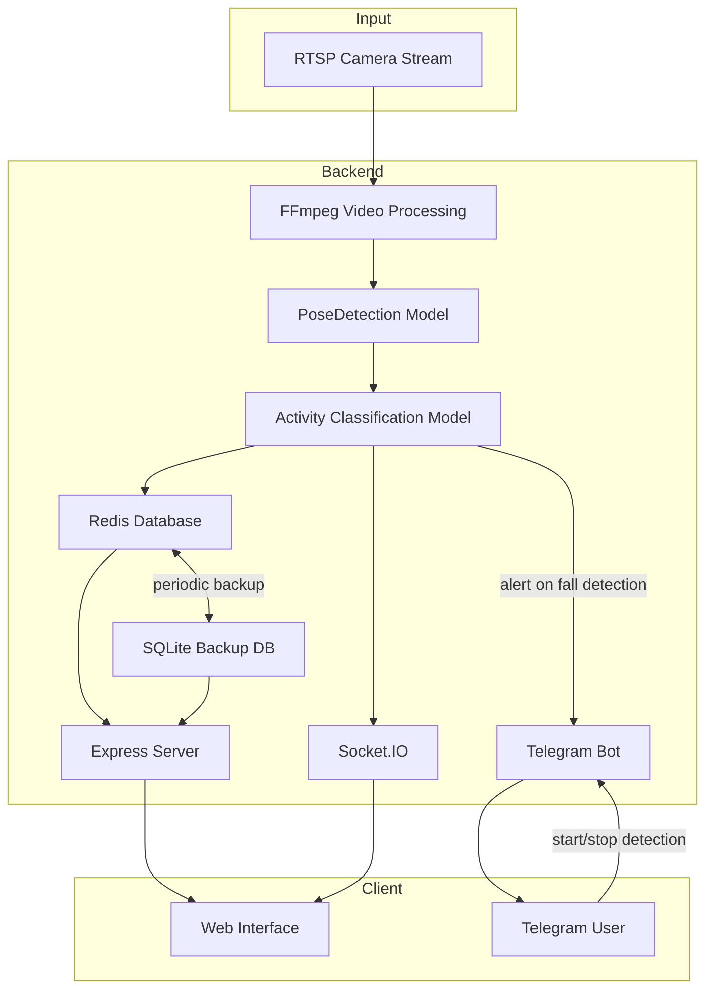

# Fall Detection System

A real-time fall detection system using computer vision and machine learning to monitor, detect, and alert caregivers about potential fall incidents that can be easily retrofitted to any existing surveillance CCTV Camera Supporting RTSP Streaming protocol.

## Overview

This project implements an automated fall detection system designed for elderly care, patient monitoring, or personal safety applications. The system analyzes video streams in real-time, identifies human poses, classifies activities, and sends immediate alerts when fall-like motions are detected.

## Features

- **Real-time Fall Detection**: Monitors video streams and detects various types of falls including:
  - Falling forward (using hands or knees)
  - Falling backward
  - Falling sideways
  - Falling while sitting in an empty chair

- **Activity Classification**: Recognizes and logs various human activities:
  - Walking
  - Standing
  - Sitting
  - Laying
  - Jumping
  - Picking up objects

- **Alert System**: Sends immediate notifications via Telegram when falls are detected

- **Timeline Analysis**: Provides historical data access through a web interface

- **Data Management**: Stores detection data with automatic backup system

## Architecture

The system consists of several interconnected components:

- **Video Processing**: Captures and processes RTSP video streams using FFmpeg
- **Pose Detection**: Utilizes TensorFlow.js and MoveNet for human pose estimation
- **Activity Classification**: Uses a custom TensorFlow model to classify poses into activities
- **Data Storage**: Redis for real-time data with SQLite backup for persistence
- **Communication**: Express server and Socket.IO for real-time updates
- **Notification**: Telegram bot integration for alerts and remote control

## Tech Stack

- **Backend**: Node.js with Express
- **Machine Learning**: TensorFlow.js with WebAssembly backend
- **Pose Detection**: TensorFlow MoveNet (SinglePose Lightning)
- **Video Processing**: FFmpeg
- **Real-time Communication**: Socket.IO
- **Data Storage**: Redis (primary) and SQLite (backup)
- **Alerting**: Telegram Bot API
- **Frontend**: HTML/CSS/JavaScript (client folder, not included in the pasted code)

## Installation

### Prerequisites

- Node.js (v14+)
- Redis server
- FFmpeg
- RTSP video source (IP camera or similar)
- Telegram Bot token

### Setup

1. Clone the repository:
   ```bash
   git clone https://github.com/darzhz/FDAR.git
   cd fall-detection-system
   ```

2. Install dependencies:
   ```bash
   npm install
   ```

3. Create a `.env` file with the following variables:
   ```
   TBOT=your_telegram_bot_token
   TUSER=your_telegram_user_id
   STREAM=your_rtsp_stream_url
   ```

4. Download the TensorFlow models:
   - Place the pose classification model in `client/tfjs/model.json`

5. Start the Redis server:
   ```bash
   redis-server
   ```

6. Run the application:
   ```bash
   node app.js
   ```

## Usage

### Web Interface

Access the web interface at `http://localhost:3001` to:
- View real-time pose detection
- Search historical detection data
- Analyze activity timelines

### API Endpoints

- `POST /timeline`: Get activity data between specified timestamps
- `POST /backup`: Force backup of Redis data to SQLite
- `POST /test`: Generate random test data

### Telegram Commands

- `/startdetection`: Start the fall detection process
- `/enddetection`: Stop the fall detection process

## Data Flow

1. Video frames are captured from the RTSP stream using FFmpeg
2. Each frame is processed by the pose detection model
3. Detected poses are classified into activities
4. Activities are stored in Redis with timestamps
5. Fall detections trigger immediate Telegram notifications
6. Redis data is periodically backed up to SQLite

## Development

### Model Training

The system uses two pre-trained models:
- MoveNet for pose detection
- Custom model for activity classification based on pose data

The classification model was likely trained on a dataset of human activities with a focus on different types of falls and normal movements.

### Adding New Activity Types

To add new activity types:
1. Update the `labels` array in the code
2. Retrain the classification model with examples of the new activity
3. Replace the model files in the client directory

## Troubleshooting

- Ensure Redis server is running before starting the application
- Check RTSP stream connectivity if no poses are being detected
- Verify Telegram bot token and user ID for proper notification delivery
